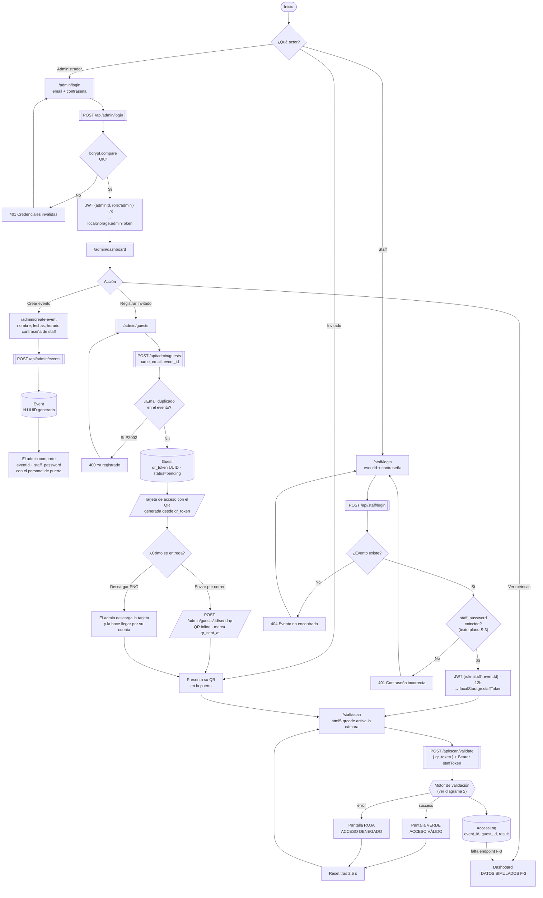
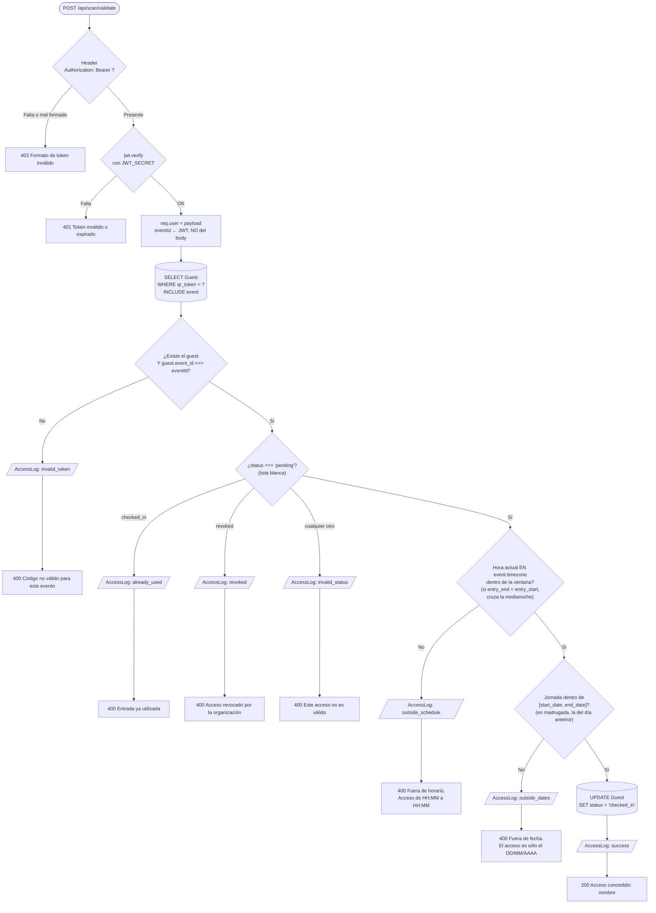
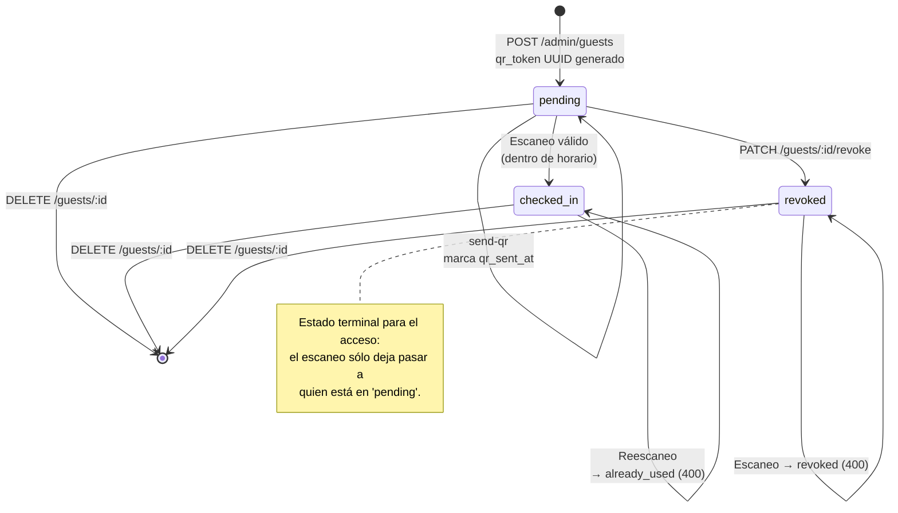
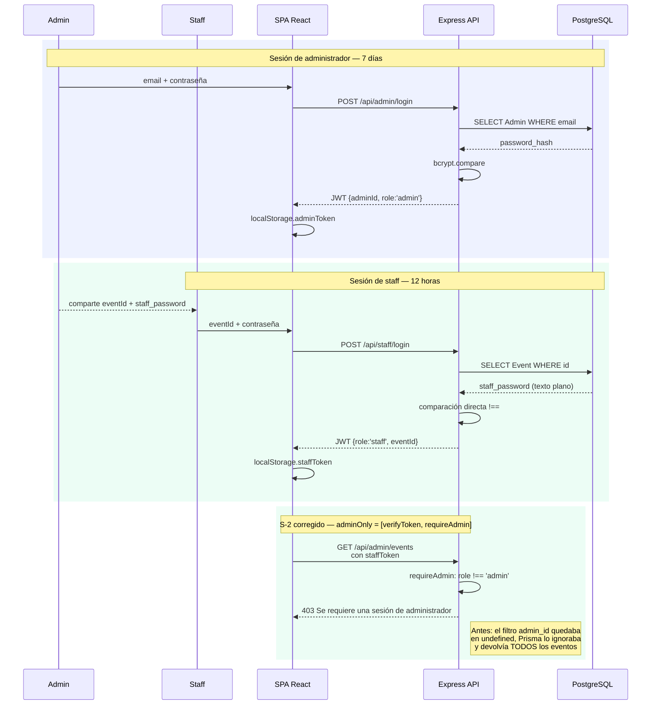
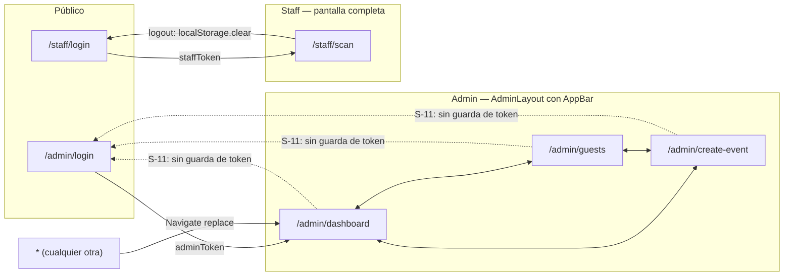

# QR Access — Diagramas de flujo

Diagramas en sintaxis Mermaid. Se renderizan directamente en GitHub, GitLab, VS Code
(extensión Markdown Preview Mermaid) y en https://mermaid.live.

---

## 1. Flujo completo del sistema

Recorre los tres actores. La entrega del código (generación + descarga o correo) ya está
implementada; ver §7 del [análisis](ANALISIS-SISTEMA.md) para lo que sigue pendiente.

---

## 2. Motor de validación del QR — `POST /api/scan/validate`

Es el núcleo del sistema, en [`backend/src/routes/scan.js`](../backend/src/routes/scan.js).
Toda la cadena está implementada. La ventana de acceso se evalúa en `event.timezone`, no en la
hora del servidor.

**Siete resultados posibles en `AccessLog.result`:**

| `result` | HTTP | Condición |
|---|---|---|
| `invalid_token` | 400 | El `qr_token` no existe, o pertenece a otro evento |
| `already_used` | 400 | El invitado ya hizo check-in |
| `revoked` | 400 | La organización revocó el acceso desde el panel |
| `invalid_status` | 400 | Cualquier otro estado distinto de `pending` (denegar por defecto) |
| `outside_schedule` | 400 | Hora actual (en `event.timezone`) fuera de la ventana de ingreso |
| `outside_dates` | 400 | La jornada no cae entre `start_date` y `end_date` |
| `success` | 200 | Acceso concedido; `Guest.status` pasa a `checked_in` |

---

## 3. Ciclo de vida de un invitado

---

## 4. Flujo de autenticación y ámbito de los tokens

Las nueve rutas protegidas de `/api/admin` exigen `verifyToken` **y** `requireAdmin`. El bloque
verde inferior muestra el caso que antes filtraba datos.

---

## 5. Mapa de rutas del frontend

> Sólo `/staff/scan` verifica el token antes de renderizar. Las tres rutas de admin se montan sin
> comprobación, así que un usuario sin sesión ve la pantalla vacía en lugar de ser redirigido.
